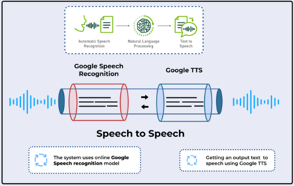

# VerbiQube

## Speech-To-Speech System

A Speech-to-Speech system that utilizes Google Speech Recognition and Google Text-to-Speech (TTS) technologies to convert spoken language into text, process it, and then convert the processed text back into speech.

## Overview

The Speech-to-Speech system works as follows:

1. **Speech Input**: The system receives spoken language input.
2. **Speech Recognition**: The input speech is converted into text using Google Speech Recognition.
3. **Natural Language Processing (NLP)**: The text is processed to understand and prepare it for speech output.
4. **Text-to-Speech (TTS)**: The processed text is converted back into speech using Google Text-to-Speech.
5. **Speech Output**: The final spoken output is produced.

## System Components

- **Google Speech Recognition**: Converts the input speech to text.
- **Natural Language Processing (NLP)**: Processes the converted text for meaningful output.
- **Google Text-to-Speech (TTS)**: Generates spoken words from the processed text.
- **Seamless Integration**: The system seamlessly integrates speech-to-text and text-to-speech functionalities.

## FLOW CHART

## Process Flow

1. **Automatic Speech Recognition (ASR)**:
   - The system uses Google's online Speech Recognition model to convert spoken language into text.
   
2. **Natural Language Processing (NLP)**:
   - The converted text is processed to understand its context and meaning.

3. **Text to Speech (TTS)**:
   - The processed text is then converted into speech using Google TTS.

4. **Output Speech**:
   - The final output is the spoken form of the processed text, completing the speech-to-speech conversion.

## Requirements

- Google Cloud account with enabled Speech-to-Text and Text-to-Speech APIs.
- Python (with `google-cloud-speech` and `google-cloud-texttospeech` libraries installed).

# Content Automation
The entire process involved in authenticating social media accounts, generating content, and posting that content to various platforms. The system integrates multiple components to automate and optimize the creation and distribution of social media content.

## Components

## 1. Authentication Process

## Authentication Flow

**Social Media Platform Connection**

The process begins by connecting the system to various social media platforms like LinkedIn, Instagram, Facebook, and Twitter (X).
Users initiate the connection by clicking the "CONNECT" button for the desired platform.

**Redirection to Authorization Page**

Upon clicking "CONNECT," the user is redirected to the respective platform's authorization page.
Here, the user must log in and grant the necessary permissions for the system to manage their account (e.g., posting content, retrieving data).

**Access Token Retrieval**

After successful authorization, the platform provides an Access_Token, which is essential for performing actions on behalf of the user.
The system also receives additional data such as Token_expiry (indicating when the token will expire) and, in some cases, a Refresh_Token (used to obtain a new access token when the current one expires).

**Token Storage**

The Access_Token, Token_expiry, and Refresh_Token are securely stored in a MongoDB database.
This allows the system to access the user's account for content posting without needing to re-authenticate each time.

## 2. Content Generation

## Generation Flow

## 2.1 Initiation of Content Generation

The process begins when there is a need to create content for social media. This could be triggered manually by a user or automatically based on a scheduled task, trending topics, or specific events.
CrewAI's agents are responsible for initiating this content generation process.

**Platform-Specific Agents**

CrewAI is equipped with multiple agents, each tailored to a specific social media platform. These agents are knowledgeable about the nuances, trends, and best practices for creating content on their respective platforms.

For example:

**Facebook Agent:** 

- Focuses on generating content that is suitable for Facebook's format, including options for text, images, and links. It might consider Facebook's algorithm preferences, such as engagement-focused content.

**Instagram Agent:**

- Generates content that emphasizes visuals, hashtags, and concise, engaging captions. It understands the importance of aesthetics and the use of appropriate filters and tags.

**Twitter (X) Agent:**

- Crafts content within the character limit, optimized for quick engagement, trending topics, and retweets. It might suggest hashtags and mentions for broader reach.

**LinkedIn Agent:** 

- Focuses on professional tone and content, generating posts that are appropriate for business networking, thought leadership, and industry-related discussions.

## 2.2 Content Creation

- Once the agent is triggered, it works in tandem with the Llama 3 language model to generate the actual content.

**Input to Llama 3:**

- The agent provides input to the Llama 3 model, which may include keywords, topics, the target audience, and any specific requirements for the post.

**Content Generation by Llama 3:**

- Llama 3 generates text based on the provided input, ensuring it aligns with the platform's guidelines and the intent of the post.

**Customization:**

- The generated content is then customized by the agent. This might involve adjusting the tone, length, or format of the text, adding relevant hashtags, mentions, or calls to action, and ensuring the content meets the platform's best practices.

## 2.3 Contextual Enhancements

- CrewAI agents can leverage DuckDuckGo Search to enhance the generated content with additional context, relevant links, or up-to-date information.

- This step ensures that the content is not only relevant but also enriched with accurate and timely information, improving its quality and engagement potential.

## 3. Posting Process

**Content Retrieval**

- Once the content is ready, it is retrieved from MongoDB along with the appropriate access token.
  
Platform-Specific Posting

- The content is formatted and prepared for posting to the specific platform.
- Using the stored access tokens, the content is posted to platforms like Facebook, Instagram, Twitter (X), and LinkedIn.

## Dependencies

MongoDB: For storing access tokens and generated content.

Groq: For accessing the Llama 3 model.

CrewAI: For generating platform-specific content.

DuckDuckGo: For privacy-focused web searches.

Social Media APIs: For connecting to and posting content on social media platforms.

